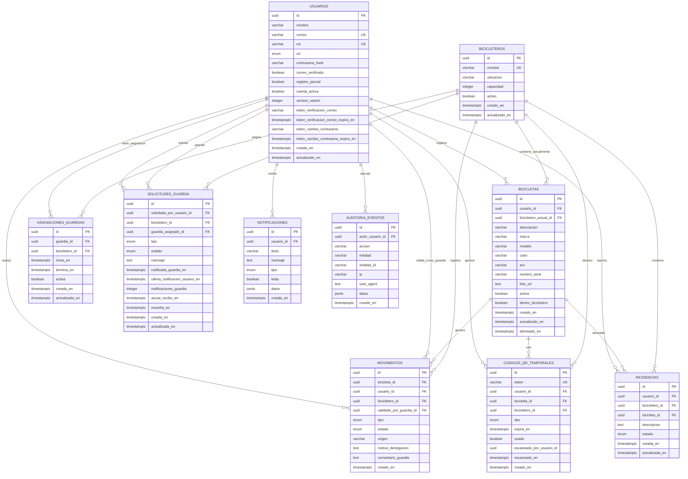

# Modelo Relacional UBBike

Este documento presenta el modelo relacional completo desarrollado para UBBike.
El repositorio `ubbike-taller` incluye este MR en código mediante el esquema de
Prisma y sus migraciones.

La fuente técnica del modelo se encuentra en `backend/prisma/schema.prisma`, con
sus migraciones en `backend/prisma/migrations`.

## Diagrama ER Completo

## Reglas De Negocio Principales

- Un usuario puede registrar muchas bicicletas.
- Una bicicleta pertenece a un único usuario.
- Solo una bicicleta por usuario deberia quedar marcada como activa.
- Las bicicletas se eliminan lógicamente con `eliminado_en`.
- Un bicicletero tiene capacidad, ubicacion y estado activo.
- Un guardia puede tener asignaciones a bicicleteros.
- Cada movimiento registra usuario, bicicleta, bicicletero, tipo, estado, origen
  y guardia que valida.
- Un movimiento puede ser confirmado o denegado.
- Si se deniega un ingreso o retiro, debe registrarse el motivo.
- Los códigos QR temporales pertenecen a un usuario y una bicicleta.
- El QR puede expirar visualmente para el usuario, pero debe marcarse como usado
  solo cuando se confirma o deniega el movimiento.
- Las solicitudes de guardia permiten pedir atención y dejar trazabilidad de
  aviso, respuesta, estado y resolución.
- Las notificaciones registran avisos relevantes para usuarios, guardias,
  administradores y central.
- Las incidencias permiten registrar problemas asociados a usuarios,
  bicicletas o bicicleteros.
- La auditoría conserva acciones importantes para revisiónes posteriores.
